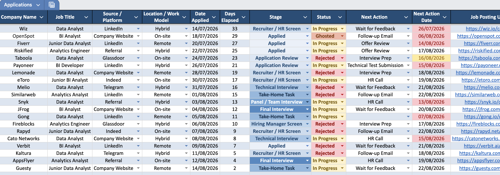
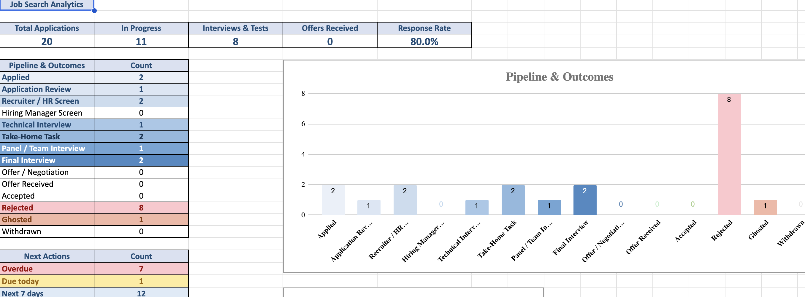
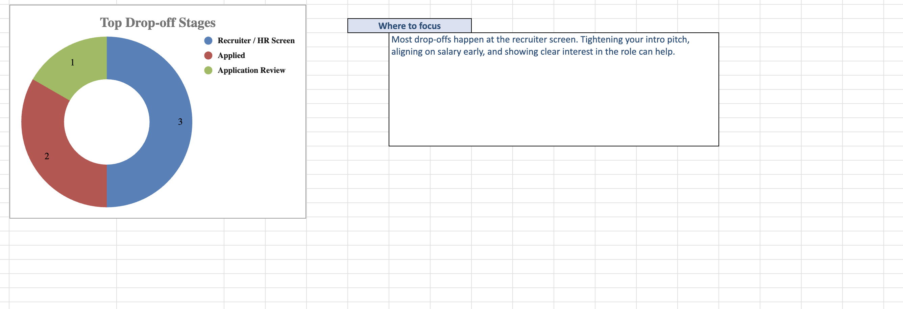

# Job Search Tracker Generator

A Python script that builds an Excel workbook for tracking job applications. It sets up the sheets, the dropdowns, the stage and outcome coloring, and a dashboard, so all you do is fill in rows.
Works with Excel, Google Sheets, and LibreOffice.







## Why a script?

Everyone's job search is different, so instead of one fixed template this is a small script you shape to yourself. Change a few lists at the top (your stages, statuses, platforms, colors) and the whole file rebuilds to match: dropdowns, dashboard, colors, and charts all stay in sync, with nothing to fix by hand. Every run produces a fresh, clean workbook, and the code is open (MIT) so you can see exactly what it does.

## What you get

- A **Dashboard** with KPIs (total, in progress, interviews & tests, offers, response rate), a Pipeline & Outcomes breakdown with a wide bar chart, a Next Actions summary (overdue, due today, next 7 days), and a Drop-off analysis: a donut of the top 3 stages where applications get rejected or ghosted, plus a gentle "where to focus" hint for the biggest one.
- A **Job Applications** table (a real Excel Table) with 19 columns. Two of them model the process side by side: **Stage** (where you are in the funnel) and **Status** (the outcome). Keeping them separate means marking an outcome never erases the stage it happened at, which is what powers the drop-off analysis. Stages are shaded in blue; outcomes are green (wins), amber (in progress), red (rejected/ghosted), or grey (withdrawn). It also has dropdowns, an AutoFilter, and the usual columns for links, salary, contacts, and notes.
- A **Lookup Lists** sheet holding the dropdown options (and, off to the side, the small helper formulas that feed the drop-off analysis).

The table grows on its own: type in the first empty row and Excel extends the formatting, dropdowns, and the Days Elapsed formula down. The dashboard formulas read whole columns, so the numbers stay correct no matter how many rows you add.

## Requirements

- Python 3.7 or newer
- xlsxwriter

## Usage

Install the dependency (just xlsxwriter):

```bash
pip install -r requirements.txt
```

Run the script:

```bash
python generate_tracker.py
```

Open the resulting `Job_Search_Tracker.xlsx` in Excel, Google Sheets, or LibreOffice; every formula recalculates when the file opens. You don't need Excel installed at all: upload the file to Google Drive and use it entirely in Google Sheets from every device.

## Configuration

Edit the constants at the top of `generate_tracker.py`:

- `INITIAL_ROWS`: how many empty rows to pre-format (default 200; the table still grows past this).
- `STAGE_STYLES`: your pipeline stages and their (blue) colors, in funnel order. Drives the Stage dropdown, the pipeline breakdown, and the drop-off analysis.
- `OUTCOME_STYLES`: your outcome statuses and their colors (In Progress, the wins, the rejections, withdrawn).
- The other dropdown lists (`PLATFORMS`, `WORK_MODELS`, `CURRENCIES`, `EMP_TYPES`, `NEXT_ACTIONS`, `RATINGS`): change them to match your own process.
- `EARLY_STAGES`, `INTERVIEW_STAGES`: stage groups the KPIs use (still In Progress at an early stage counts as "no response yet"; the interview stages feed "Interviews & Tests").
- `SUCCESS`, `BAD_OUTCOMES`: the wins that get highlighted, and the outcomes counted in the drop-off funnel (Withdrawn is left out on purpose).
- `STAGE_HINTS`, `NOT_ENOUGH_DATA`, `DROP_OFF_MIN`: the focus hypotheses, the fallback text, and how many drop-offs in total are needed before a focus hint appears (default 5).
- `COLOR_PRIMARY`: the theme color.
- `DATE_FORMAT`: how dates display (default `dd/mm/yyyy`).
- `DATE_OVERDUE`, `DATE_TODAY`, `DATE_UPCOMING`: the colors for a Next Action Date that is overdue, due today, or coming up this week.

## Notes

- Stage vs Status: keep `Stage` at the furthest point an application reached, and set `Status` to the outcome. `In Progress` is a Status you leave in place while a role is live. Because the two are separate columns, marking `Rejected` keeps the stage it happened at, so the drop-off analysis knows where you tend to lose momentum.
- The drop-off analysis counts `Rejected` and `Ghosted` by stage. The donut fills in from the very first drop-off; the focus hint appears once there are at least `DROP_OFF_MIN` drop-offs in total (default 5) and then points at the most frequent stage, so a couple of unlucky results don't get over-read. The hints are gentle hypotheses to think about, not verdicts.
- `Offer / Negotiation` is a Stage (you're at the offer step); `Offer Received` is a Status (the outcome). They're named distinctly on purpose.
- The example row uses real dates (relative to today), so the demo always looks current. Dates display as `dd/mm/yyyy`; change `DATE_FORMAT` for another style.
- All formulas use plain A1-style references, so they behave the same in Excel, Google Sheets, and LibreOffice.
- Next Action Date is highlighted automatically: amber when it is today, red when it is overdue. The dashboard also counts how many are overdue, due today, or coming up in the next 7 days.
- Running the script won't overwrite an existing `Job_Search_Tracker.xlsx`; it stops and asks you to move or rename the old file first, so you never lose data.
- The script is safe to `import` (it builds the file only when run directly). To generate from your own code, call `build_tracker(path)`.

## Contributing

This is a small personal project, shared in case it is useful to others. Bug reports and pull requests are welcome through GitHub Issues.

## License

MIT License. Copyright (c) 2026 Alex Rabinovich. See the [LICENSE](LICENSE) file.

You are free to use, change, and share this. The only condition is that the copyright notice (my name) stays in the LICENSE file that ships with the code.
